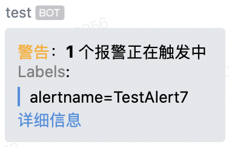
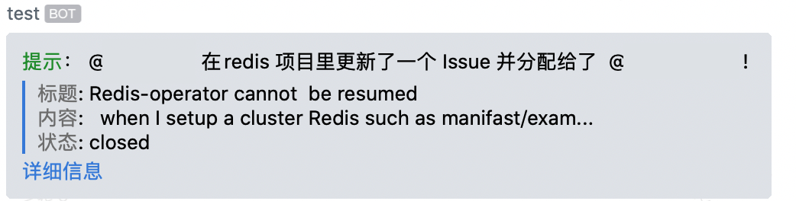

# gitllab-wechat-hook

支持 Gitlab 与 Alertmanager 接入企业版微信

效果如下：





可以自定义报警模板：

```yaml
- wechat_hook: https://qyapi.weixin.qq.com/cgi-bin/webhook/send?key=xxx
  config:
    - event: Issue Hook
      type: markdown
      content: |
        <font color="info">提示</font>： @{{.User.Username}} 在{{.Project.Name}} 项目里更新了一个 Issue {{ if .Assignees }}并分配给了 {{range .Assignees}} @{{.Name}} ! {{end}}{{end}}

        > <font color="comment">标题</font>: {{.ObjectAttributes.Title}}
        > <font color="comment">内容</font>: {{ $length := len .ObjectAttributes.Description }} {{ if gt $length 50 }} {{slice .ObjectAttributes.Description 0 50}}...{{else}}{{.ObjectAttributes.Description}}{{end}}
        > <font color="comment">状态</font>: {{.ObjectAttributes.State}}

        [详细信息]({{.ObjectAttributes.URL}})
    - event: Pipeline Hook
      type: markdown
      content: |
        <font color="warning">警告</font>: {{.Project.Name}} pipeline 构建失败!
        > <font color="comment">分支</font>:  {{.ObjectAttributes.Ref}}
        > <font color="comment">耗时</font>:  {{.ObjectAttributes.Duration}} 秒
        > <font color="comment">状态</font>: {{.ObjectAttributes.Status}}

        [详细信息]({{.Project.WebURL}}/pipelines/)

    - event: AlertManager Hook
      type: markdown
      content: |
        {{if eq .Status "firing"}}<font color="warning">警告</font>：**{{ len .Alerts }}** 个报警正在触发中 {{else}}<font color="info">提示</font>: 报警已恢复{{end}}

        <font color="comment">Labels</font>:
        {{range .Alerts}}
        {{if .Labels}}
        {{range $key, $value := .Labels}}
        > {{$key}}={{$value}}
        {{end}}
        {{end}}


        {{if .Annotations}}
        <font color="comment">Annotations</font>:
        {{range $key, $value := .Annotations}}
        > {{$key}}={{$value}}
        {{end}}
        {{end}}

        {{end}}

        [详细信息]({{.ExternalURL}})
```
